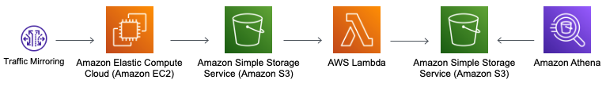

# siphon

### HISTORY

On June 25th, 2019, Amazon Web Services (AWS) released VPC Traffic Mirroring for Nitro-based instances encapsulated over VXLAN on UDP port 4789. Support was expanded on February 10th, 2021, to include limited Xen instance types.



https://docs.aws.amazon.com/vpc/latest/mirroring/traffic-mirroring-considerations.html

### EXISTING

Three great open-source network security monitoring solutions in alphabetical order already exist!

- Arkime - https://github.com/arkime
- Rock NSM - https://github.com/rocknsm
- Security Onion 2 - https://github.com/Security-Onion-Solutions

### CONFIGURATION

Siphon was built using the Cloud Deployment Kit (CDK) to attach an instance with minimum specifications to an existing VPC that performs network security monitoring using Suricata and Zeek with S3 storage.

Minimum requirements are network connectivity to the monitored resource with an instance that has 2 vCPUs, 2 GiB Memory, and 8 GB Storage.

- https://github.com/4n6ir/siphon/blob/main/siphon/siphon_stack.py#L35
- https://github.com/4n6ir/siphon/blob/main/siphon/siphon_parser.py#L21

```
vpc_id = 'vpc-04eae279ceb94d7f6'    # <-- Enter VPC ID
ec2_count = 1                       # <-- Enter EC2 Quantity
ec2_type = 't3a.small'              # <-- Enter EC2 Size
ebs_root = 8                        # <-- Enter Root Storage GBs
ebs_data = 4                        # <-- Enter Data Storage GBs
```

A network monitoring interface is attached to every subnet in the configured VPC based on the availability zone. 

- https://github.com/4n6ir/siphon/blob/main/siphon/siphon_stack.py#L400

Ubuntu 20.04 was used for long-term support and software dependencies but does not have AWS CLI installed by default requiring a second installation stage using the SSM agent.

### ZAT

Zeek Analysis Tools (ZAT) from Brian Wylie at Super Cow Powers provides a Python package that converts the compressed Zeek logs to Apache Parquet columnar storage for Athena searches.

https://github.com/SuperCowPowers/zat

### ATHENA

The S3 bucket containing the Parquet files is partitioned by Zeek log, year, month, day, and hostname to limit search volume since it is billed by the terabyte (TB).

https://docs.zeek.org/en/master/script-reference/log-files.html

- broker.log
- capture_loss.log
- cluster.log
- conn.log
- dhcp.log
- dns.log
- dpd.log
- files.log
- http.log
- kerberos.log
- known_certs.log
- known_hosts.log
- known_services.log
- notice.log
- ntp.log
- packet_filter.log
- software.log
- ssl.log
- stats.log
- tunnel.log
- weird.log
- x509.log

### SOFTWARE

A two-stage configuration script to install and configure a stand-alone packet capture sensor for network security monitoring. 

- af_packet - https://github.com/J-Gras/zeek-af_packet-plugin
- awscliv2 - https://docs.aws.amazon.com/cli/latest/userguide/install-cliv2-linux.html
- cwagent - https://github.com/aws/amazon-cloudwatch-agent
- suricata - https://suricata.readthedocs.io/en/suricata-6.0.0/install.html#ubuntu
- zeek - https://github.com/zeek/zeek/wiki/Binary-Packages

### CONFIGURATION

The af_packet interface is a device-level packet socket that scales processing across threads to form a fanout group to the Suricata and Zeek engines.

- /etc/suricata/suricata.yaml
- /opt/zeek/etc/node.cfg

### S3 BUCKET ARCHIVE

AWS CLI version 2 is used to sync the compressed log files from the local EBS volume to the S3 bucket every 15 minutes.

### DISK CLEANUP

Unix commands are executed every hour to keep only 7 days of logs available on the local EC2 instance.

### IDS UPDATES

ET OPEN rulesets are updated every day at 11 AM UTC.
